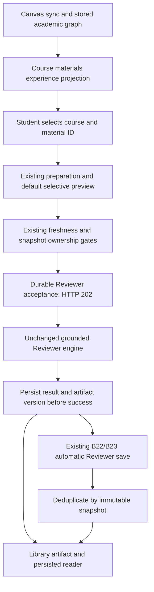
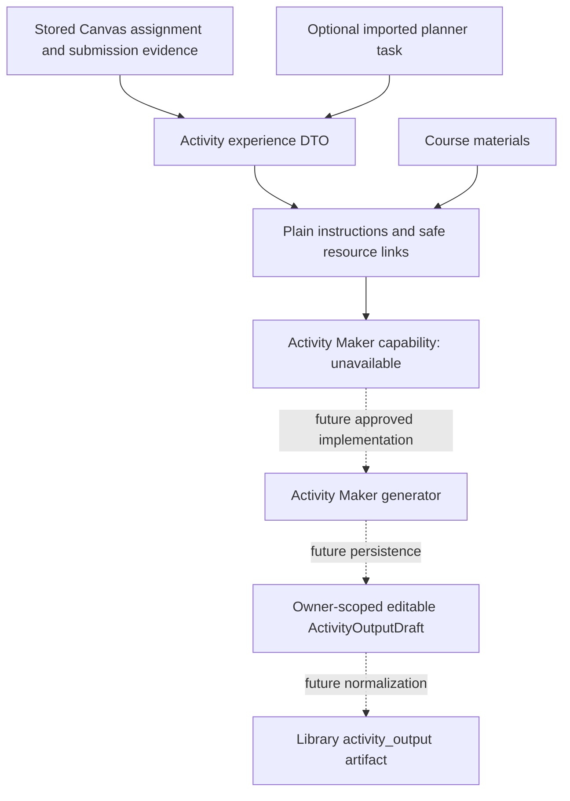
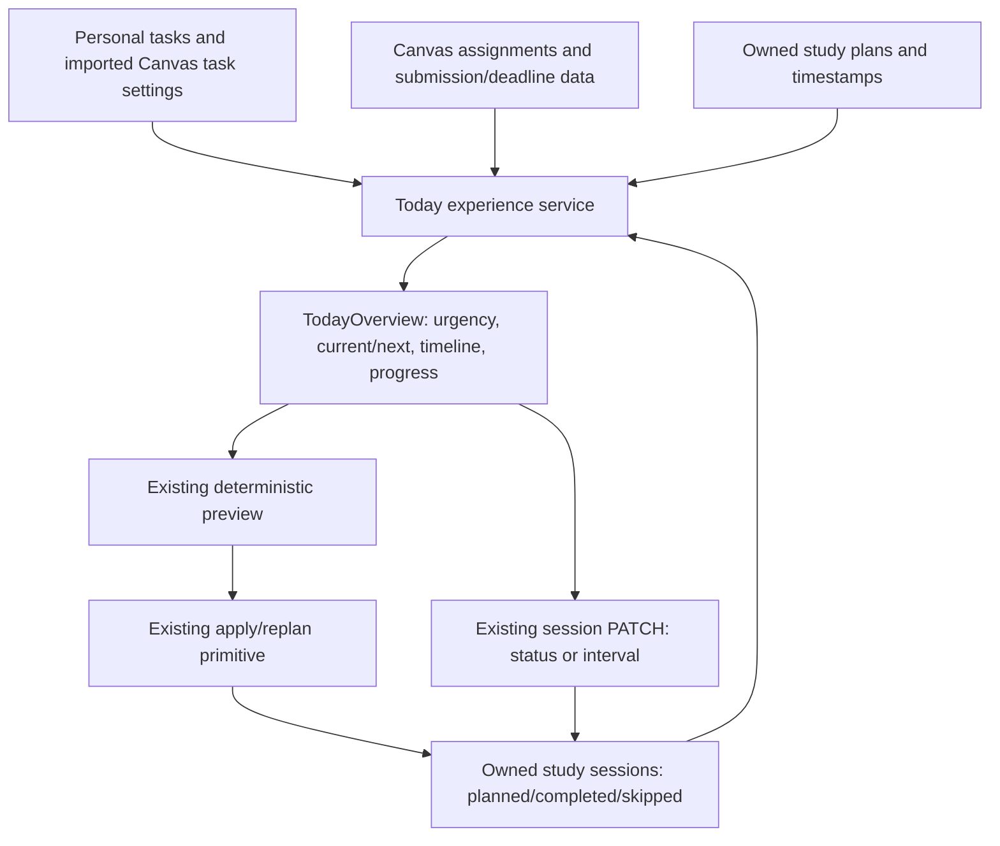

# B24.5 UI data flow

## Learn to Library

Client uses GET experience/courses, course workspace/materials, optional POST
materials/prepare, POST generations with an idempotency key, GET generations/:id
and GET library/:artifactId. The client does not join source structures or job
provenance. Polling returns stable lifecycle states and actual unit counts.
Opening Library reads existing results only. A repeated generation key recovers
accepted work with matching owner/course/material identity.

## Activity to future Activity Maker

Dashed edges are missing backend functionality, not working mock behavior.
Activity IDs are distinct from planner task IDs and study-session IDs.
Current output arrays are empty. No AI draft is created by opening ActivityDetail.

## Today and planning

GET /api/today defines the date and offset boundary server-side. No new
scheduling algorithm or class/calendar data is invented. Assignment imports are
explicit mutations through the existing task import endpoint.

All protected arrows originate with verified Supabase identity. Read adapters
use authenticated RLS plus owner predicates; existing privileged mutations and
Canvas resolvers retain their explicit owner authorization. No credential,
private Storage location, extraction diagnostic, generation prompt or sourceCore
structure is a student-facing field.
