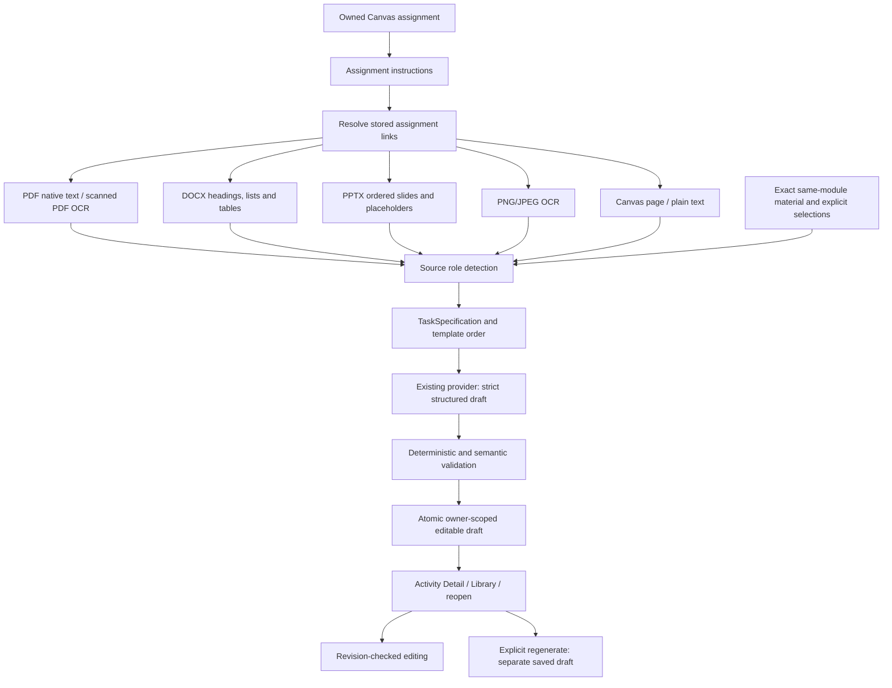

# Activity Maker data flow

Admission first verifies JWT, assignment ownership and selected-material ownership, then persists an idempotent `activity_generation` job. Preparation, provider work and persistence run under the existing worker/Workflow lease. Progress comes from actual job stages, with no estimated percentage.

Source priority is:

1. Canvas assignment instructions.
2. Instructor template identified from an assignment resource or explicit selection.
3. Assignment attachments/resources and directly linked Canvas files/pages. Canvas’s stored assignment HTML provides the same link evidence for these two categories, so both retain the `attachment` role.
4. Exact same-module course context: prepared files and stored pages, ordered by module item position and id.
5. Explicitly selected owned course materials not already included.

No other fuzzy/course-wide material is added. Same-module worksheets do not become the current instructor template merely because their filenames contain “worksheet”. The prompt receives course context automatically. Material ownership is constrained by user, selected course and Canvas connection; arbitrary external links are not downloaded. A referenced file/page missing from synchronized data fails with a safe source-unavailable result.

There are at most 12 selected resources plus assignment instructions, at most 20000 extracted characters per file/page through the existing preview boundary, and at most 120000 source characters overall. Oversized or ambiguous inputs fail explicitly instead of being silently truncated into a different assignment.

The final transaction rechecks assignment identity and lease/cancellation state. Draft content is validated before it reaches that transaction. Stored source summaries include opaque material ids and content hashes; private Storage paths and provider metadata remain internal. A successful job is visible only after its draft and result are persisted.
