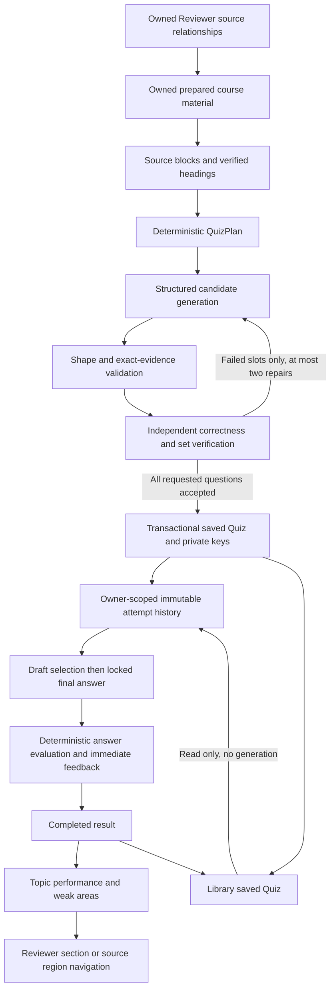

# B24.7 data flow

Generation runs on the existing processing-job/Workflow architecture. Plan and
accepted-question checkpoints are private. A job result contains only the saved
Quiz ID; keys and evidence never cross the unanswered API boundary. The worker
rechecks source ownership before transactional completion; the database refuses
completion after cancellation or lease loss.

Public `quizzes.questions` and the learner projection contain only IDs, question
type, prompt, options, selection instruction and difficulty. Topic labels,
source evidence and explanations are omitted before answer finalization because
even a topic heading can reveal an answer. Feedback unlocks only the finalized
question. Starting over creates a new attempt, retaining all prior results.
