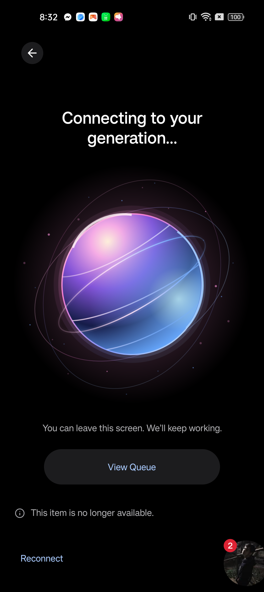

# Website V1.1 orb parity investigation — 2026-10-08

**BLOCKED — Authoritative mobile WebGL source or required verification is unavailable.**

The currently routed mobile orb was located and inspected. It is React Native
Animated plus layered SVG, not a WebGL implementation. No authoritative mobile
WebGL orb, GLSL shaders, 3D mesh, camera or material configuration was found in
the inspected sources. Porting this SVG or inventing a new shader would not meet
the owner's explicit real-time 3D and reuse requirements. No substitute was made.

## Starting state and scope

- Website worktree: `C:/Projects/stay-focused-v2-website`.
- Branch: `website/functional-v1`; starting HEAD:
  `6a8032ac0ad1431f9987b5eb6e9404db957148da`; initially clean.
- Reviewed the five existing commits, oldest first: `b3a9316`, `16efa94`,
  `f4dd1d8`, `655c2b0`, `6a8032a`, including their changes and acceptance record.
- Read root AGENTS, AUTOPILOT, current planning, ADR-019, web README and
  `website-v1.md`. The environment's OneDrive cwd is an asset directory, not
  the website Git checkout.
- Original mobile checkout: `C:/Projects/stay-focused-v2`, `main`, `de09b9c`.
  Its pre-existing tracked and untracked work was inspected read-only and
  preserved. B25.3.3 remains paused and incomplete.
- Finite scope: locate the actual mobile renderer, port it without redesign,
  verify rendering/state/lifecycle parity and preserve all existing features.
  Source discovery is a prerequisite for implementation and parity acceptance.

## A. Mobile source of truth

The live route `apps/mobile/app/(app)/generation.tsx` exports GenerationScreen
from `apps/mobile/src/features/redesign/GenerationScreen.tsx`. That screen
imports `./GenerationOrb` and renders `<GenerationOrb running={running && !!id} />`.
The route therefore establishes the current component, rather than its filename
or an older prototype alone.

| Item | Actual implementation |
| --- | --- |
| Component | `apps/mobile/src/features/redesign/GenerationOrb.tsx` |
| Tests | `apps/mobile/src/features/redesign/GenerationOrb.test.ts` |
| Dependencies | React Native Animated/Easing/PanResponder, react-native-svg, navigation focus, design theme |
| Geometry | SVG cubic Bezier BLOB path, circles, ellipses and clipped paths in a 260×260 viewBox; 320×320 composition in a frame with minimum height 332 |
| Shaders / materials / camera | None; no vertex/fragment shader, uniforms, noise, mesh, lights, perspective or GPU material configuration to reuse |
| Layers | Halo, body, spectrum wash, highlights, orbital light, touch light |
| Ambient timing | Breathe 3600/3900ms; drift 5200/4900ms; spectrum 6200/6800ms; linear orbit 18000ms |
| Easing | Easing.inOut(Easing.ease) for ping-pong channels; linear orbital rotation |
| Resting values | breathe 0.35, drift 0.2, spectrum 0.25, orbit 0.08; press/pulse 0 |
| Body movement | Drift X −3…4, breathe Y 3…−2, rotation −3…4 degrees, scaleX 0.975…1.03, scaleY 1.025…0.98, breathe scale 0.985…1.025 |
| Press / release | Spring to 0.94 scale; brighter touch layer while held; release 160ms pulse to 1.035 scale then spring back; termination has no pulse |
| Spring | Theme motion: damping 18, stiffness 180, mass 0.8 |
| Motion lifecycle | Ambient loops only while running, route focused, app active and reduced motion disabled; reset on stopping; stop values on unmount |
| Reduced motion | Balanced resting phase; no ambient loops or press/pulse scaling; immediate held-light response |
| Theme | Body gradient at offset 0.7 uses #192252 dark / #6878D2 light; remaining colors unchanged |
| Shared palette | violet #9C74EF, pink #ED8BCC, blue #6A9DEE from `apps/mobile/src/design/themeTokens.ts` |

The B25.2.1 report at `docs/ai/acceptance/b25.2.1/generation-orb-repair.md`
explicitly records Animated + SVG and no shader/3D engine. Git history identifies
`0a0d754` as the orb animation repair. Current mobile and website-worktree copies
of GenerationOrb have identical content ignoring line endings; their raw file
hashes differ because of checkout newline conventions. No dirty mobile orb
replacement was present.

### Search coverage

Inspected mobile/web apps, packages, dependency manifests, orb filenames, GLSL
extensions, route imports and rendering symbols. Searched every locally known
branch/remote-tracking tip with `git grep` for ShaderMaterial, fragmentShader,
vertexShader, GLView, expo-gl, expo-three, @react-three and WebGLRenderer under
apps/packages. No matching mobile implementation was found. No remote fetch or
claim about unavailable remote revisions is made.

Also searched the accessible damaged-backup, recovery and parser-bakeoff folders,
the OneDrive V2/CIT17 assets, and nearby `stay-focused` / `stay-focused-showcase`
projects. The showcase's `src/PhoneScene.jsx` uses React Three Fiber/Drei to
render a phone, lighting and a ScreenFeed texture; it is not a mobile orb
renderer. Asset SVGs and captured videos/images do not supply the required
original WebGL source. Requested the location of any other authoritative source.

### State mapping discovered, not implemented

The mobile component has one boolean ambient state, `running`, plus independent
press/release feedback. It does not define separate success/error animations or
receive numerical generation progress.

| Mobile GenerationView state | Mobile ambient behavior | Existing website job equivalent |
| --- | --- | --- |
| queued | Running when an accepted id exists | queued |
| preparing, generating, finalizing | Running | running (job contract does not expose these three visual phases separately) |
| No data yet | Running only if an id exists | Website waits for job data before displaying its generation content |
| completed, failed, cancelled | Resting orb remains mounted | succeeded, failed, expired, cancelled; website currently removes its image (expired has no separate mobile GenerationView state) |
| cancelling | Resting; not in mobile running-state list | cancellation_requested currently remains active on web; no new cancellation effect justified |
| Background / blurred / reduced motion | Ambient off | Browser visibility/unmount/media preference would require adaptation after source resolution |

This is a source investigation, not a newly connected state machine. Existing
backend status and progress handling remain untouched.

## B. Web implementation

No runtime files or dependencies added/modified. No renderer or shared module
was invented. Current implementation remains:

- `apps/web/src/features/queue.tsx`: Next Image displays
  `/generation-orb.svg` only for queued/running/cancellation_requested jobs.
- `apps/web/public/generation-orb.svg`: a 200×200 gray radial-gradient circle;
  its own description calls it a static vector approximation.
- `apps/web/app/globals.css`: `.orb` is 200×200 with a 3.2-second CSS breathing
  wrapper; global reduced-motion rules suppress animations.

The current image is not a WebGL compatibility fallback and is not parity proof.
Directly portable SVG paths, palette, timing and interaction specifications were
identified, but none provides the required original 3D renderer. Browser
resize/DPR/disposal/context-loss/SSR adaptations cannot be accepted for a
renderer that has not been supplied.

Documentation-only files added/modified:

- Added `docs/ai/acceptance/website-orb-parity.md` (this report).
- Modified `docs/ai/acceptance/website-v1.md` (appended reference).
- Modified `docs/current-state.md` (current V1.1 blocker).
- Modified `docs/roadmap.md` (current V1.1 blocker).
- Modified `docs/ai/current_sprint.md` (current V1.1 blocker).

No production config, schema/RLS, prompt/model/pipeline, mobile code or API
behavior changed. No deployment, push, merge, OpenAI call or paid generation.

## C. Visual comparison

Historical physical mobile references (inspected as historical evidence, not
fresh device captures):

- `docs/ai/acceptance/b25.2.1/device/generation-orb-frame-a.png`
- `docs/ai/acceptance/b25.2.1/device/generation-orb-pressed.png`
- `docs/ai/acceptance/b25.2.1/device/generation-orb-released.png`

Fresh website captures were obtained with the existing isolated generation
fixture and visually inspected at 390×844 and 1440×1000:

- `.local/website-qa/generation-progress-light-mobile.png`
- `.local/website-qa/generation-progress-dark-mobile.png`
- `.local/website-qa/generation-progress-light-desktop.png`
- `.local/website-qa/generation-progress-dark-desktop.png`

| Historical mobile reference | Fresh website dark phone capture |
| --- | --- |
|  |  |

These establish the current discrepancy, not WebGL parity. The mobile screenshot
has a pink/violet/blue body, colored halo, curved highlights and orbital detail;
the website renders a gray circle. Both website themes show the same gray
surface. The four web captures show a centered, unstretched 200px image without
visible clipping or overflow. They do not reproduce the mobile composition.
The browser fixture uses reduced motion, not equivalent mobile animation times.

| Area | Result | Difference / verification limit |
| --- | --- | --- |
| Geometry / silhouette | Unresolved | Mobile irregular layered SVG vs web circle; authoritative 3D mesh unavailable |
| Colors | Unresolved | Mobile pink/violet/blue vs web grayscale |
| Shaders | Blocked | No original mobile shaders located; website has none |
| Lighting / depth | Blocked | Mobile uses drawn gradient/highlight layers; original 3D lighting unavailable |
| Surface distortion / rotation / timing | Unresolved | Mobile independent layer transforms vs web wrapper breathing |
| State transitions / interaction | Unresolved | Mobile resting orb and press/release feedback absent on web |
| Light / dark | Baseline captured; parity unresolved | Current web SVG has no mobile theme-dependent gradient |
| Phone / desktop | Baseline captured; parity unresolved | Centered without stretching/clipping; fixed 200px image differs from mobile 320px composition |

No deterministic equivalent-time GPU comparison, pixel-equivalence assertion,
platform tolerance or accepted rendering deviation is claimed. Static references
cannot establish animation parity.

## D. Functional verification

Verification is of the unchanged baseline at `6a8032a`, not of a new WebGL port.
Fresh logs remain ignored under `.local/website-orb-qa/`.

- FRESH PASS: `npm run typecheck -- --force`: 8/8 tasks, 0 cached, 26.528s.
- FRESH PASS: `npm run lint -- --force`: 8/8 tasks, 0 cached, 24.343s;
  four existing mobile import/first warnings, zero errors and no web warnings.
- FRESH PASS: `npm run test --workspaces --if-present`: API 996 passed / 4
  skipped; mobile 467; web 10; Canvas 73; engine 606 deterministic evaluations;
  OCR 27; shared 52. Total **2,231 passing**, 4 skipped. The historical 2,205
  figure is preserved in website-v1; this run counts 52 shared tests rather than
  its reported 26. No tests added or removed by this task.
- FRESH PASS: `npm run test --workspace @stay-focused/mobile -- src/features/redesign/GenerationOrb.test.ts`:
  4/4 tests in one file; lifecycle, reduced motion, press/release and cleanup.
  These four are included in the mobile total above, not additional tests.
- FRESH PASS: `npm run build -- --force`: 8/8 tasks, 0 cached,
  1m52.993s; Next web/API production builds and mobile web/iOS/Android exports.
  Metro logged an ENOENT skip while Next removed its temporary
  `apps/web/.next/export/_next` directory; all exports completed successfully.
  Next regenerated `apps/api/next-env.d.ts`; this task-generated change was
  inspected and restored to HEAD after the build, keeping the diff docs-only.
- FRESH PASS: `node scripts/web-browser-check.mjs`: Chromium localhost
  fictional Auth/API flow, 19 recorded checks, ten major screens, both themes,
  390×844 and 1440×1000 layouts, keyboard and 720px reflow; zero uncaught
  page errors, zero provider/production requests, zero generation admissions.
  Evidence: `.local/website-qa/browser-result.json`; log:
  `.local/website-orb-qa/browser.log`.
- FRESH PASS: `node scripts/web-browser-check.mjs --generation-fixture`:
  19 recorded Chromium checks, including ambiguous Reviewer admission retry
  with the same idempotency key, Quiz settings, completed-output navigation and
  four generation screenshots. Three fictional fixture admissions; zero actual
  provider/production requests and zero uncaught page errors.
  Evidence: `.local/website-qa/browser-generation-result.json`; log:
  `.local/website-orb-qa/browser-generation.log`.
- FRESH PASS: `git diff --check`; only the five documentation files above
  remain changed after restoring the task-generated Next declaration file.
- New web orb component/state/GPU lifecycle tests: BLOCKED, no original WebGL
  implementation located and no port made. Existing mobile orb tests run in
  the full mobile suite; they validate Animated/SVG behavior only.
- Physical device, fresh mobile GPU reference and equivalent-time comparisons:
  NOT RUN / BLOCKED by unavailable required WebGL source/reference.
- Secondary browser engine: NOT RUN; baseline harness is Chromium-only. No
  cross-engine WebGL claim.
- Dedicated console/hydration-warning collection, WebGL initialization/context
  recovery, duplicate-loop instrumentation, repeated renderer mount/unmount and
  deterministic animation-state screenshots: NOT RUN / BLOCKED for the missing
  WebGL port. The existing browser harness asserts uncaught page errors, not
  every console message; its PASS does not establish these additional gates.
- Live authenticated backend/provider acceptance remains blocked as historically
  documented. Fixture services do not establish live acceptance.

## E. Known differences

| Classification | Finding |
| --- | --- |
| Fixed | No rendering discrepancies fixed; no substitute implemented |
| Acceptable platform-specific difference | None accepted without an original WebGL reference |
| Unresolved | Current gray circle, geometry, motion, interaction, terminal presentation and theme discrepancies above |
| Blocked by unavailable reference | Requested mobile WebGL renderer, GLSL, mesh/material/lighting/camera and fresh equivalent-state visual proof |

## F. Final acceptance status and next action

**BLOCKED — Authoritative mobile WebGL source or required verification is unavailable.**

The current mobile orb source was found, but it does not implement the requested
WebGL rendering technology. Preserve the existing website until the owner
identifies the actual WebGL implementation (repository, branch/commit and file
path). Then inspect that renderer and port it before deterministic visual and
lifecycle verification. If the intended source is instead the located SVG orb,
the owner must resolve the conflict with the explicitly required real-time 3D
rendering before that different implementation scope can proceed.
