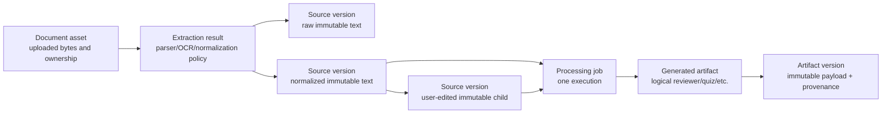

# ADR-012: Reusable processing assets and multi-job operation

Status: accepted R2 foundation; production worker and device validation pending

## Decision

Processing jobs are executions, not the canonical home of reusable inputs or
outputs. R2 keeps the existing durable job state machine while separating five
long-lived concepts:



`processing_job_sources` remains an immutable execution snapshot for backward
compatibility and audit. It now points at the canonical document/source
entities. A successful result points at an extraction result or artifact
version, so retry, reuse, cleanup, and offline cache code no longer treat the
job row as the durable product object.

The additive migrations are:

- `20260723084329_reusable_processing_assets.sql`
- `20260723084855_processing_worker_operations.sql`
- `20260723085823_processing_daily_page_quota.sql`
- `20260723090006_processing_quota_concurrency_hardening.sql`
- `20260723091048_processing_account_deletion_hardening.sql`
- `20260723091222_processing_artifact_soft_delete.sql`
- `20260723091515_processing_storage_cleanup_guard_index.sql`
- `20260723091627_processing_lifecycle_batching.sql`

Both are applied to the development Supabase project. The first migration
backfills the existing durable extraction and reviewer rows. Legacy uploaded
documents do not have a trustworthy raw-byte SHA-256, so their content hash is
left null and exact extraction reuse is deliberately disabled.

## Entity responsibilities

| Entity | Owner | Mutability | Purpose |
|---|---|---|---|
| `document_assets` | one user | metadata and soft-delete state mutable | private Storage identity, raw-byte hash, selected source |
| `extraction_results` | one user | append-only by application policy | extraction policy, diagnostics, raw/normalized version links |
| `source_versions` | one user | database-enforced immutable | extracted, normalized, imported, Canvas, or user-edited text revision |
| `generated_artifacts` | one user | latest-version pointer and soft-delete mutable | logical artifact independent of an execution |
| `generated_artifact_versions` | one user | database-enforced immutable | payload and complete generation provenance |
| `processing_jobs` | one user | state-machine mutations only | one queued/running/terminal execution |
| `processing_job_events` | one user | delivery state only | safe, deduplicatable notification input |

The client may directly select only owner-readable asset/version metadata under
RLS. Private job sources, results, events, cleanup rows, policy rows, and worker
heartbeats remain service-only. API reads repeat the owner predicate because
they use the service role. Cross-user matching, deduplication, reuse offers, and
artifact discovery are forbidden even when hashes happen to match.

## Versioning and edit conflicts

Every text change inserts a new `source_versions` row. Update and delete
triggers reject mutations to source and artifact versions. The edit RPC
requires the expected parent SHA-256, preserves the parent, and inserts a child
even when another device already created a sibling. Selecting the child as the
document's active source uses compare-and-set against the previous selected
version. If that check loses, the response reports a conflict and leaves both
edits recoverable.

The initial client foundation keeps an unsynced draft separately and never lets
a server refresh overwrite a cache entry marked `unsyncedSourceEdit`. The
remaining product work is a merge/choose-version screen and real concurrent
multi-device interaction testing.

## Provenance and reuse

Artifact versions persist:

- source version ID and source content SHA-256;
- artifact type;
- generation policy, engine, schema, and provider IDs;
- normalized language/output settings fingerprint;
- generation job ID and creation time.

Extraction reuse is automatic only for the same owner and an exact match of raw
file SHA-256, MIME type, byte size, parser policy, OCR policy, and normalization
version. The API computes the raw-byte hash; a client-supplied hash is never
trusted.

Artifact reuse requires the same owner, exact source version, exact source
content hash, artifact type, settings fingerprint, and all generation version
identifiers. New generation is the default. An exact prior result is merely
offered through `reuseCandidateArtifactVersionId`; the caller must explicitly
send `reuseMode: "reuse_existing"` to reuse it. A reused request still creates a
terminal audit job/result linked to the prior artifact version. Partial,
similarity, cross-user, stale-policy, and private cross-account reuse are out of
scope.

## API and bounded retrieval

`GET /api/jobs` without query parameters remains backward-compatible and
returns active work. `scope=all` adds bounded history retrieval with a maximum
limit and opaque `(created_at,id)` cursor. Status responses include safe
source/artifact identity, reuse mode/candidate, policy provenance, state,
timestamps, and real page/section units. They never include uploaded bytes,
source text, reviewer payloads, credentials, or provider request bodies.

Source-version reads and revision writes use authenticated owner-scoped routes.
Result reads return the canonical extraction/artifact version identifiers and
safe provenance.

## Queue ordering, fairness, and backpressure

Claims remain atomic with `FOR UPDATE SKIP LOCKED`, leases, job heartbeats, and
stale-lease recovery. R2 ranks eligible work in this order:

1. under-served job type for the user;
2. retry priority class (150) before ordinary new work (100);
3. scheduled/next-attempt time;
4. accepted time and UUID for deterministic ties.

The claim query partitions candidates by both user and job type and admits at
most the configured running count per user. This prevents one user or one job
type from consuming an entire bounded claim while still letting retryable work
make progress. Provider rate limits receive a longer 60-1,800 second delay;
other retryable failures use bounded exponential delay.

The conservative default policy is:

| Limit | Default |
|---|---:|
| active jobs per user | 6 |
| queued extractions per user | 3 |
| queued generations per user | 4 |
| jobs created per user per hour | 20 |
| extractions per user per day | 20 |
| extraction pages accepted per user per day | 200 |
| generations per user per day | 25 |
| simultaneously running jobs per user | 1 |
| source versions per document | 20 |
| worker process concurrency | 2, hard-capped at 4 |

Limits live in the service-only `processing_policy_config` row so operations can
tune them without shipping subject-specific application logic. Limit errors
use safe codes and never reveal other users' demand.
Final admission is serialized per account with a transaction-scoped advisory
lock, closing simultaneous-request races after the API's early quota checks.

## Mobile multi-job and offline model

The Processing screen is the central collection view. It groups work as
Running, Waiting, Needs attention, and Recent. Each row owns its own
cancel/retry/open/dismiss/local-remove action; starting or dismissing one job
does not replace another. The local store keeps up to 50 safe references,
prioritizes active work, and retains terminal references for seven days.

Offline generation requests are local intents, not fake server jobs. A local
request ID and durable idempotency key are stored with an account ID, source
reference, operation, artifact type, settings, and state. The source text draft
is stored separately. Reconciliation:

1. pauses intents at logout;
2. resumes only the matching account after authentication;
3. verifies that the local source still exists;
4. submits once with the same idempotency key;
5. treats an ambiguous timeout as retryable and lets the server return the same
   job on replay;
6. removes the intent only after a real server job ID is accepted.

The authenticated app also retries the outbox on sign-in, foreground entry, and
every ten seconds while foregrounded. A per-account in-memory gate prevents two
screens from flushing the same outbox concurrently; the durable idempotency key
still protects ambiguous process/network failure. Reviewer text generation is
implemented; durable offline document-upload staging and immediate OS network
reachability callbacks remain future work.

## Offline completed-artifact cache

Completed artifacts are cached by artifact version and owner. On native iOS and
Android, the existing session-store abstraction uses SecureStore; web
development falls back to browser local storage and must not be presented as
encrypted at rest. The bounded policy is:

- at most 50 metadata entries;
- roughly 90,000 serialized characters total;
- least-recently-opened payloads evicted first;
- metadata retained after payload eviction;
- explicit stale status when the server's latest version differs;
- strict owner filtering on every read;
- unsynced edits are never silently replaced by refresh.

The cache is a device convenience, not a source of truth. A different account
cannot read another account's entries, and sign-out pauses pending work rather
than relabeling it.

## Retention, deletion, and cleanup

| Data | Default policy |
|---|---|
| failed/cancelled/expired jobs | 30 days and past idempotency expiry |
| successful execution rows | 90 days and past idempotency expiry |
| terminal events | 30 days after delivery/ineligibility; undelivered safety ceiling 60 days |
| idempotency protection | 30 days |
| source versions | max 20 per document; no automatic destructive compaction yet |
| worker heartbeat history | stale rows removed after 30 days, 50 at a time |
| deleted document bytes | seven-day delayed Storage cleanup queue |
| account-deleted bytes | queued before the user cascade and eligible immediately |

`run_processing_lifecycle_cleanup()` is dry-run by default and deletes only
bounded terminal history: at most 500 eligible events, 100 failed/cancelled
jobs, 100 completed jobs, and 200 orphan execution snapshots per run. Active
states are excluded. Database deletion and Storage deletion are intentionally
separate. Use:

```text
npm run cleanup:processing --workspace @stay-focused/api
```

to inspect counts. Destructive execution requires both `--execute` and
`PROCESSING_CLEANUP_CONFIRM=delete_due_processing_objects`. Storage deletions
are claimed, retried with bounded delay, and logged only as aggregate counts.
Failed staging removal is inserted idempotently as `orphaned_staging`; the
cleanup runner rechecks that no live document references that path before
deleting it.

Document deletion is soft. Active jobs block deletion. If generated artifacts
depend on the document, the default is to block; the explicit
`preserve_artifacts` policy keeps those artifacts while queueing original bytes
for deletion. This choice prevents an accidental cascade from erasing a user's
finished study material.

Artifact deletion is independently soft: it marks only the logical
`generated_artifacts` row and preserves every source and immutable artifact
version for retention/audit. A rolled-back database check verifies that the
referenced source still exists after the artifact is hidden. A future
user-facing delete route must call this service-only boundary after explicit
authorization.

The owner-scoped provenance foreign keys are commit-deferred because the graph
contains intentional cycles (document/selected source, job/result, and
artifact/latest version). This keeps normal transactions fully checked at
commit while allowing one `auth.users` cascade to remove every owned database
row atomically. A rolled-back integration fixture builds the complete graph,
deletes its synthetic account, verifies all owned rows are gone, and verifies
that the private Storage path was queued first.

## Notification-ready events

Terminal events carry a unique delivery key, eligibility flag, safe label, and
optional artifact version reference. A future push dispatcher can deduplicate
by delivery key and send only generic completion/attention copy. Token
registration, permission UX, delivery receipts, and development-build device
tests are not implemented.

## Operations and cost controls

`processing_worker_heartbeats` records running/stopped/error state, capacity,
active count, build revision, and last-seen time without hostnames or private
job metadata. Job heartbeats still protect individual leases.

```text
npm run ops:processing --workspace @stay-focused/api
```

prints aggregate queue/status counts, oldest active age, p50/p95 duration,
retry/failure/rate-limit counts, provider-call and source-size units, reuse
count, worker heartbeat ages, and cleanup backlog. It selects at most 1,000
recent rows and emits no user IDs, source names, text, object paths, or payloads.
The R2 migrations add indexes for owner history, exact reuse, fair claims,
event delivery, cleanup scheduling, and every advisor-reported owner-scoped
foreign key.

## Generalization and remaining proof

Production contracts contain no subject vocabulary. Neutral tests cover
Biology, History, and technical documentation through the same fingerprint and
generation boundaries. Existing generalized OCR and Stage 0-6 coverage,
grounding, leakage, and source-token fidelity checks remain authoritative.

The implementation is still `PARTIAL` for production readiness until a
continuously available worker is deployed, cleanup is scheduled, the mobile
flow is exercised on a physical iPhone/development build, app termination and
relaunch are tested, push delivery is implemented, and concurrent source edits
are tested across two real devices/accounts.

Future artifact types (`flashcards`, `quiz`, `summary`, `practice_test`, and
`study_guide`) already fit the generic tables and fingerprints. They still need
their own engine/schema versions, validation, routes, and UI before they can be
enabled.
